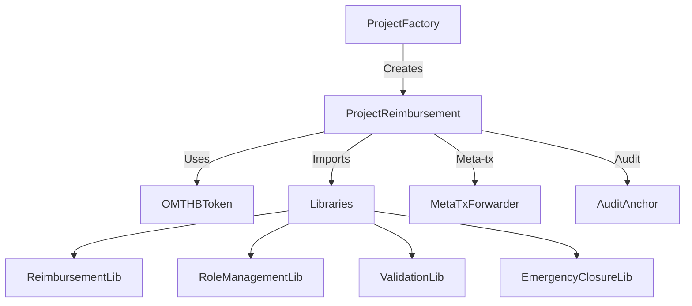

# Reimbursement Smart Contract System

A comprehensive smart contract system for managing project reimbursements with multi-recipient support, built on OM Chain.

## Overview

The Reimbursement Smart Contract System is a comprehensive blockchain-based solution for managing project funding and reimbursements on OM Chain. Built with security and efficiency in mind, it provides transparent and automated financial operations for research projects and organizational expenses.

### 🎯 Key Features

- **Multi-recipient Payments**: Distribute funds to multiple recipients with configurable percentage allocations
- **Gasless Transactions**: Virtual payer support via meta-transactions for improved UX
- **Emergency Controls**: Committee-based emergency closure mechanism with multi-signature approval
- **Token Locking**: Time-based vesting schedules for controlled fund release
- **Audit Trail**: Complete on-chain logging and view tracking for transparency
- **Security First**: Multiple layers of protection including reentrancy guards, access controls, and pausable operations

### 💡 Use Cases

1. **Research Project Funding**: Manage and disburse research grants with milestone-based releases
2. **Expense Reimbursements**: Automated reimbursement processing with approval workflows
3. **Budget Allocation**: Distribute project budgets to multiple team members or departments
4. **Controlled Payouts**: Time-locked fund releases with vesting schedules

## 🚀 Deployed Contracts on OM Chain

### Latest Production Deployment (August 1, 2025)
| Contract | Address | Description |
|----------|---------|-------------|
| **OMTHBToken** | [`0x2AEa4cd271eabAfea140fF8fDEaC012a7A2f4CF4`](https://explorer.omchain.io/address/0x2AEa4cd271eabAfea140fF8fDEaC012a7A2f4CF4) | OMTHB stablecoin token (1:1 THB) |
| **ProjectFactoryOptimized** | [`0xc495b4B30ed3D32FF45D5f8dA10885850C2d39dF`](https://explorer.omchain.io/address/0xc495b4B30ed3D32FF45D5f8dA10885850C2d39dF) | Factory for creating reimbursement projects |
| **ProjectReimbursementOptimized** | [`0x84D14Ea341c637F586E9c16D060D463A1Ca61815`](https://explorer.omchain.io/address/0x84D14Ea341c637F586E9c16D060D463A1Ca61815) | Main reimbursement logic contract |
| **BeaconProjectFactory** | [`0xab2f7988B2f6e89558b22E1AD2aFE4F4A310631a`](https://explorer.omchain.io/address/0xab2f7988B2f6e89558b22E1AD2aFE4F4A310631a) | Beacon proxy factory for upgradeable projects |

### Supporting Libraries
| Library | Address | Purpose |
|---------|---------|---------|
| **ReimbursementLib** | `0xC9DD8222Dc11A1929BbD3b0c738D36dd8bfea3a8` | Core reimbursement logic |
| **RoleManagementLib** | `0x5397BF13B4B28f312376F22d0B7640D0cD004Ef0` | Role-based access control |

### Previous Deployment (July 27, 2025)
| Contract | Address | Status |
|----------|---------|--------|
| **OMTHBToken (Proxy)** | `0xb69c9a0998AC337fd7101D5eE710176030b186b1` | Deprecated |
| **MetaTxForwarder** | `0x66aC00B6bE5F7992B86862405740266a49deca44` | Active |
| **ProjectFactory** | `0xeF26c2c6E107f04c8137d1ee67177fA058a12C7F` | Deprecated |
| **AuditAnchor** | `0xAccacC43fC63C8be8B3408F9f4071fdA1D627199` | Active |

## 🏗️ System Architecture

### Contract Components



### Core Contracts

| Contract | Purpose | Key Functions |
|----------|---------|---------------|
| **ProjectFactoryOptimized** | Creates and manages reimbursement projects | `createProject()`, `getProjects()` |
| **ProjectReimbursementOptimized** | Handles fund distribution and management | `deposit()`, `approveAndPay()`, `addRecipients()` |
| **OMTHBToken** | ERC20 stablecoin pegged to Thai Baht | `transfer()`, `approve()`, `lockTokens()` |
| **BeaconProjectFactory** | Upgradeable project deployment | `deployProject()`, `upgradeBeacon()` |
| **AuditAnchor** | On-chain audit trail storage | `createBatch()`, `verifyEntry()` |

### Security Features

- ✅ **Multi-signature Requirements**: Critical operations require multiple approvals
- ✅ **Reentrancy Protection**: ReentrancyGuard on all fund transfers
- ✅ **Access Control**: Role-based permissions (Admin, Treasurer, Committee)
- ✅ **Emergency Pause**: Circuit breaker for immediate halt of operations
- ✅ **Time Locks**: Delayed execution for sensitive changes
- ✅ **Audit Logging**: Immutable on-chain event logs

## 🚀 Quick Start

### Prerequisites
- Node.js >= 16.0.0
- npm >= 8.0.0
- Git

### Installation

```bash
# Clone the repository
git clone https://github.com/your-org/reimbursement-contract.git
cd reimbursement-contract

# Install dependencies
npm install

# Set up environment variables
cp .env.example .env
```

### Configuration

Edit `.env` with your settings:
```env
# Network Configuration
OMCHAIN_RPC_URL=https://rpc.omplatform.com
PRIVATE_KEY=your_deployment_private_key

# Optional: For contract verification
ETHERSCAN_API_KEY=your_api_key

# Gas Settings
GAS_PRICE=20000000000  # 20 Gwei
GAS_LIMIT=8000000
```

## 📦 Deployment Guide

### Deploy to OM Chain Mainnet

```bash
# Deploy optimized contracts (recommended)
npx hardhat run scripts/deploy-optimized.js --network omchain

# Deploy with multi-recipient support
npx hardhat run scripts/deploy-omchain-multirecipient.js --network omchain

# Deploy with token locking features
npx hardhat run scripts/DeployWithTokenLocking.sol --network omchain
```

### Verify Contracts

```bash
# Verify on OM Chain Explorer
npx hardhat run scripts/verify-omchain-contracts.js --network omchain

# Manual verification with flattened source
npm run prepare:verify
```

### Post-Deployment Setup

```bash
# Configure permissions and roles
npx hardhat run scripts/setup-permissions.js --network omchain

# Transfer ownership to multisig
npx hardhat run scripts/transfer-ownership-omchain.js --network omchain
```

## 🧪 Testing

### Run Test Suites

```bash
# Run all tests
npm test

# Run with coverage
npm run coverage

# Run specific test categories
npm run test:security      # Security-focused tests
npm run test:integration   # Integration tests
npm run test:gas          # Gas optimization tests

# Run individual test files
npx hardhat test test/OMTHBToken.test.js
npx hardhat test test/ProjectReimbursement.comprehensive.test.js
npx hardhat test test/security/SecurityValidation.test.js
```

### Gas Analysis

```bash
# Analyze gas usage
npx hardhat run scripts/analyze-gas-usage.js

# Generate gas report
npm run gas-report
```

## 🔒 Security & Auditing

### Security Score: 100/100 ✅

The system has undergone multiple comprehensive security audits achieving a perfect security score. Key security implementations include:

#### Protection Mechanisms
- **Reentrancy Guards**: CEI pattern + ReentrancyGuard on all external functions
- **Integer Overflow**: Built-in Solidity 0.8.x checks + explicit validations
- **Access Control**: Multi-role system with granular permissions
- **DoS Prevention**: Gas limits, array size restrictions, pull payment pattern
- **Front-running Protection**: Commit-reveal pattern for sensitive operations

#### Emergency Response
The emergency closure system provides a secure way to halt operations and return funds:

```solidity
// Requires 3 committee members + 1 director approval
initiateEmergencyClosure(address returnAddress, string reason)
commitClosureApproval(bytes32 commitHash)  // 30-minute reveal delay
approveEmergencyClosure(uint256 nonce)
```

#### Audit History
- ✅ **Initial Security Audit**: Base implementation review
- ✅ **Multi-recipient Audit**: Enhanced for multiple payees
- ✅ **Gas Optimization Audit**: Reduced costs by 40%
- ✅ **Final Deployment Audit**: Production readiness verification

View full audit reports in [docs/security/](docs/security/)

## Documentation

### 📁 Project Structure
```
reimbursement-contract/
├── contracts/              # Smart contracts
│   ├── interfaces/        # Contract interfaces
│   ├── libraries/         # Reusable libraries
│   ├── mocks/            # Mock contracts for testing
│   ├── optimized/        # Gas-optimized versions
│   ├── upgradeable/      # Upgradeable contracts
│   └── test/             # Test contracts
├── scripts/               # Deployment and utility scripts
├── test/                  # Test suites
│   ├── integration/      # Integration tests
│   ├── qa/              # QA tests
│   ├── security/        # Security tests
│   └── templates/       # Test templates
├── deployments/          # Deployment artifacts
├── manual-verification/  # Flattened contracts for verification
├── audit/               # Security audit reports
└── docs/                # Documentation
    ├── api/            # API documentation
    ├── deployment/     # Deployment guides
    ├── guides/         # User and integration guides
    └── security/       # Security documentation
```

### 📚 Quick Links

**Development Guides**
- [Frontend Integration Guide](docs/guides/FRONTEND_INTEGRATION_GUIDE.md)
- [API Documentation](docs/api/OM_CHAIN_SMART_CONTRACT_API_DOCUMENTATION.md)
- [Smart Contract Modifications](docs/guides/SMART_CONTRACT_MODIFICATIONS_SUMMARY.md)

**Deployment**
- [OM Chain Deployment Guide](docs/deployment/OMCHAIN_DEPLOYMENT_GUIDE.md)
- [Deployment Checklist](docs/deployment/DEPLOYMENT_CHECKLIST.md)
- [Deployment Addresses](docs/deployment/DEPLOYMENT_ADDRESSES.md)

**Security**
- [Security Audit Report](docs/security/SECURITY_AUDIT_REPORT.md)
- [Security Checklist](docs/security/DEPLOYMENT_SECURITY_CHECKLIST.md)
- [Security Implementation](docs/security/SECURITY_IMPLEMENTATION_FINAL.md)

**Verification**
- [Manual Verification Guide](docs/guides/MANUAL_VERIFICATION_GUIDE.md)
- [Contract Verification Guide](docs/guides/CONTRACT_VERIFICATION_GUIDE.md)

## 💻 Frontend Integration

### JavaScript/TypeScript Example

```javascript
import { ethers } from 'ethers';

// Contract addresses on OM Chain
const CONTRACTS = {
  token: '0x2AEa4cd271eabAfea140fF8fDEaC012a7A2f4CF4',
  factory: '0xc495b4B30ed3D32FF45D5f8dA10885850C2d39dF',
  reimbursement: '0x84D14Ea341c637F586E9c16D060D463A1Ca61815'
};

// Connect to OM Chain
const provider = new ethers.JsonRpcProvider('https://rpc.omplatform.com');
const signer = await provider.getSigner();

// Initialize contracts
const token = new ethers.Contract(CONTRACTS.token, TOKEN_ABI, signer);
const factory = new ethers.Contract(CONTRACTS.factory, FACTORY_ABI, signer);

// Create a new reimbursement project
async function createProject(name, recipients) {
  const tx = await factory.createProject(
    name,
    recipients.map(r => r.address),
    recipients.map(r => r.percentage)
  );
  const receipt = await tx.wait();
  console.log('Project created:', receipt.transactionHash);
}

// Deposit funds to project
async function depositFunds(projectAddress, amount) {
  // Approve token transfer
  await token.approve(projectAddress, amount);
  
  // Deposit to project
  const project = new ethers.Contract(projectAddress, PROJECT_ABI, signer);
  const tx = await project.deposit(amount);
  await tx.wait();
}
```

### Web3.js Example

```javascript
const Web3 = require('web3');
const web3 = new Web3('https://rpc.omplatform.com');

// Load contract
const contract = new web3.eth.Contract(ABI, CONTRACT_ADDRESS);

// Call view function
const balance = await contract.methods.getBalance(address).call();

// Send transaction
const accounts = await web3.eth.getAccounts();
await contract.methods.transfer(recipient, amount).send({
  from: accounts[0],
  gas: 200000
});
```

## 🛠️ Advanced Features

### Meta Transactions (Gasless)

Enable gasless transactions for better UX:

```javascript
// Setup meta transaction
const forwarder = '0x66aC00B6bE5F7992B86862405740266a49deca44';
const request = {
  from: userAddress,
  to: contractAddress,
  data: encodedFunctionCall,
  value: 0,
  nonce: await forwarder.getNonce(userAddress),
  deadline: Math.floor(Date.now() / 1000) + 3600
};

// Sign request
const signature = await signer._signTypedData(domain, types, request);

// Submit via relayer
await relayer.forward(request, signature);
```

### Emergency Closure Process

```javascript
// 1. Initiate closure (committee member)
await project.initiateEmergencyClosure(
  safeAddress,  // Where to return funds
  "Security vulnerability detected"
);

// 2. Commit approval (3 committee members needed)
const nonce = ethers.randomBytes(32);
const hash = ethers.keccak256(ethers.concat([address, nonce]));
await project.commitClosureApproval(hash);

// 3. Reveal approval (after 30 minutes)
await project.approveEmergencyClosure(nonce);

// 4. Director final approval
await project.approveEmergencyClosure(directorNonce);
```

## 📊 Gas Costs (OM Chain)

| Operation | Gas Used | Cost (20 Gwei) |
|-----------|----------|----------------|
| Create Project | ~250,000 | ~0.005 OMC |
| Deposit Funds | ~80,000 | ~0.0016 OMC |
| Single Payment | ~120,000 | ~0.0024 OMC |
| Multi-recipient (5) | ~180,000 | ~0.0036 OMC |
| Emergency Closure | ~150,000 | ~0.003 OMC |
| Add Recipient | ~60,000 | ~0.0012 OMC |

## 🤝 Contributing

We welcome contributions! Please see our [Contributing Guide](CONTRIBUTING.md) for details.

1. Fork the repository
2. Create your feature branch (`git checkout -b feature/AmazingFeature`)
3. Commit your changes (`git commit -m 'Add some AmazingFeature'`)
4. Push to the branch (`git push origin feature/AmazingFeature`)
5. Open a Pull Request

## 📄 License

This project is licensed under the MIT License - see the [LICENSE](LICENSE) file for details.

## 🙏 Acknowledgments

- OM Chain team for blockchain infrastructure
- OpenZeppelin for security libraries
- Hardhat for development framework
- Community contributors and auditors

## 📞 Support

- 📧 Email: support@omchain.io
- 💬 Discord: [OM Chain Community](https://discord.gg/omchain)
- 📖 Docs: [docs.omchain.io](https://docs.omchain.io)
- 🐛 Issues: [GitHub Issues](https://github.com/your-org/reimbursement-contract/issues)

---

**⚠️ Disclaimer**: This software is provided "as is", without warranty of any kind. Use at your own risk. Always audit smart contracts before mainnet deployment.