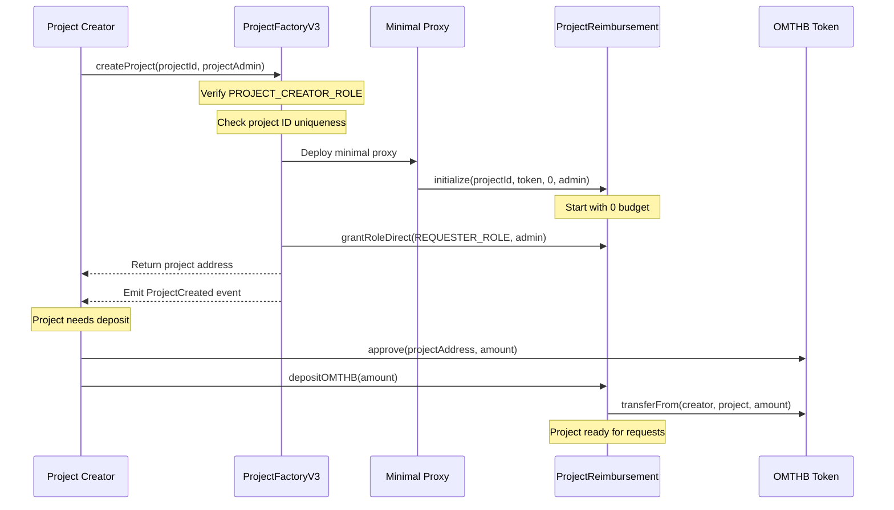
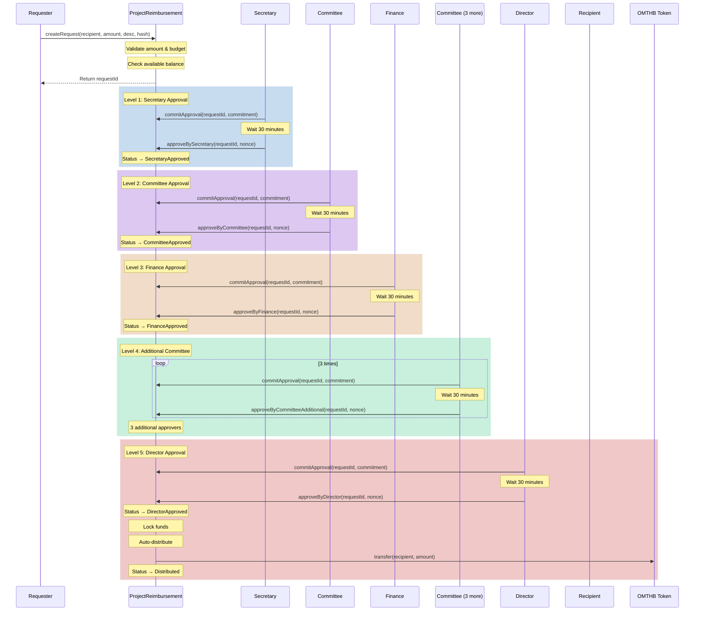
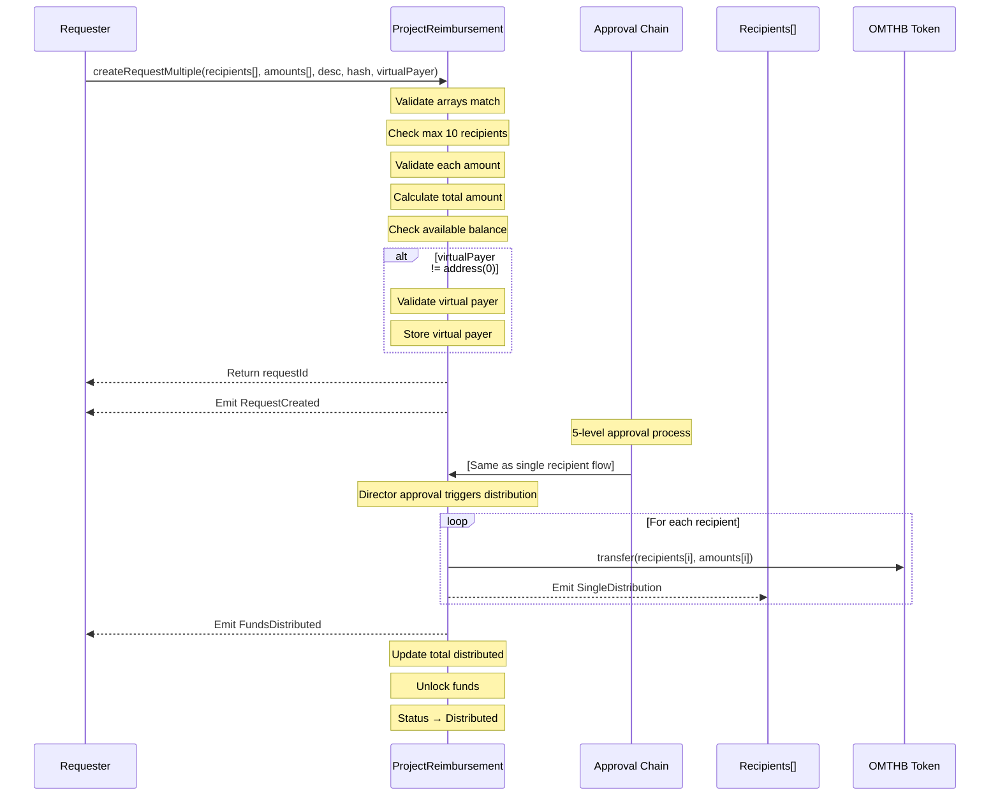
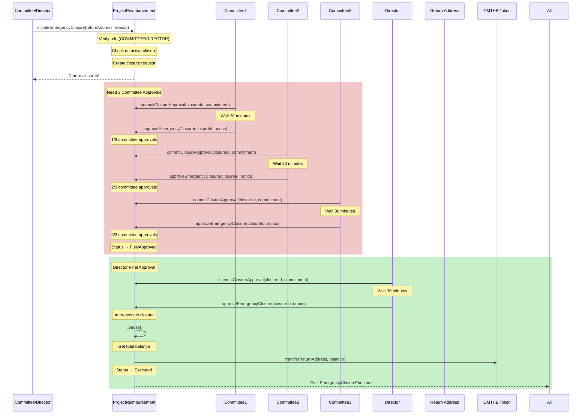
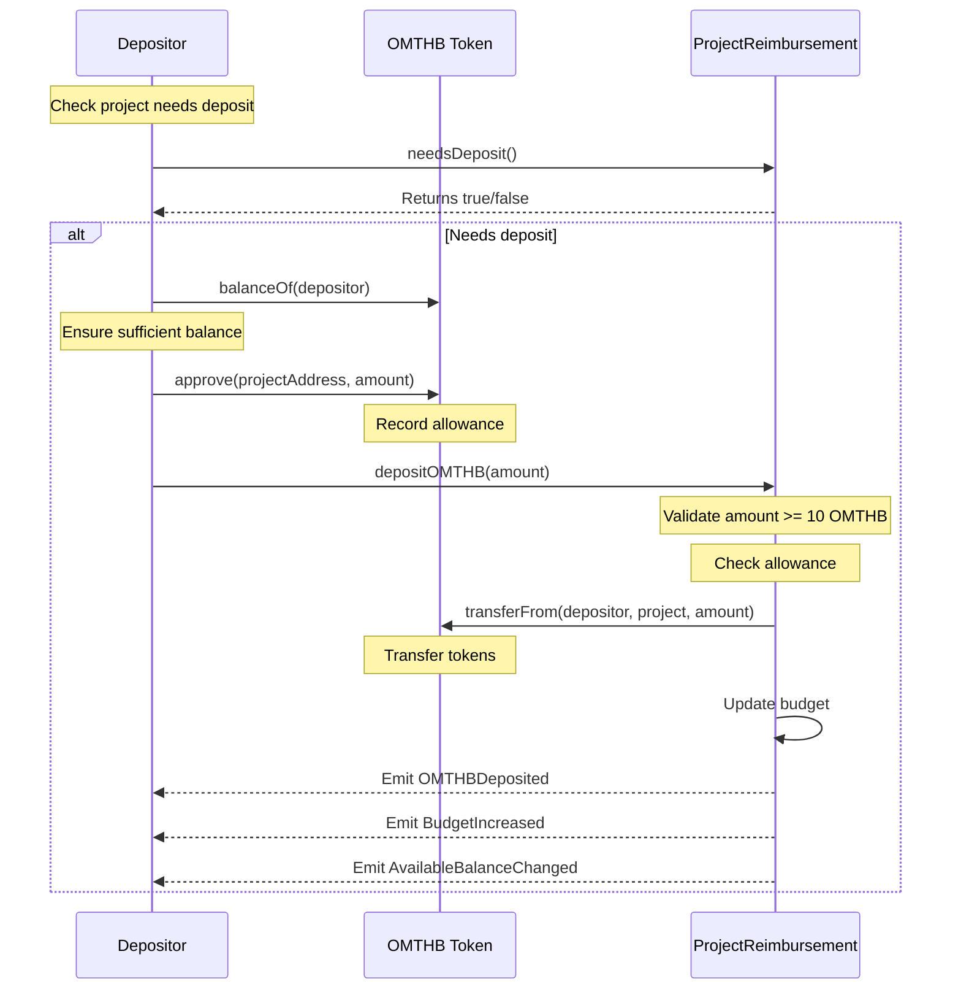
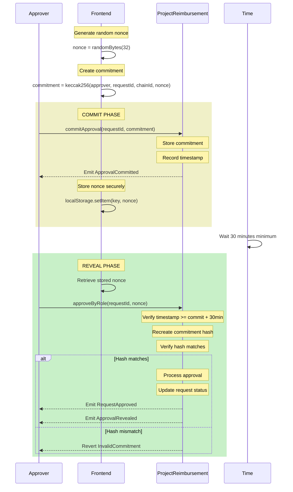
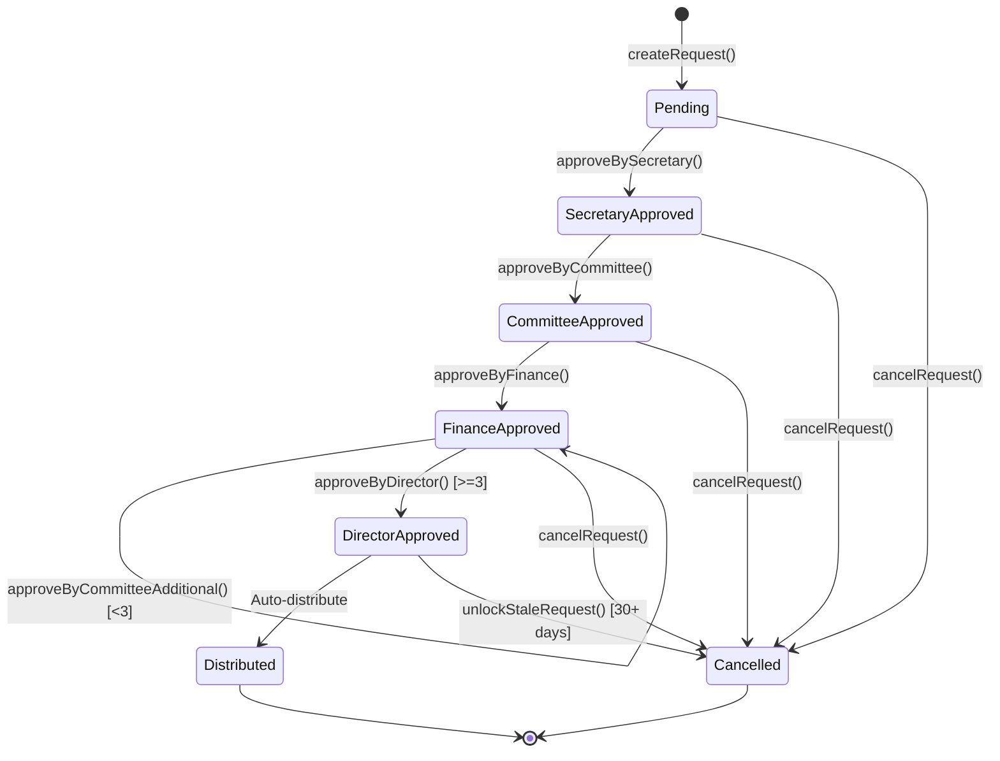
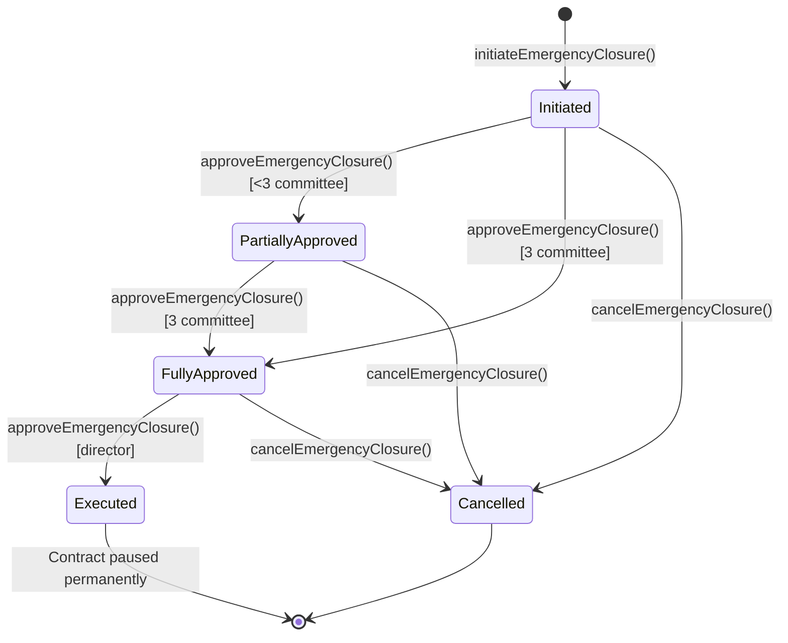

# Reimbursement System Workflows

This document provides detailed workflow diagrams for all major operations in the reimbursement smart contract system.

## Table of Contents

1. [Project Creation Flow](#project-creation-flow)
2. [Single Recipient Reimbursement Flow](#single-recipient-reimbursement-flow)
3. [Multiple Recipients Reimbursement Flow](#multiple-recipients-reimbursement-flow)
4. [Emergency Closure Flow](#emergency-closure-flow)
5. [Token Deposit Flow](#token-deposit-flow)
6. [Commit-Reveal Approval Pattern](#commit-reveal-approval-pattern)

## Project Creation Flow

## Single Recipient Reimbursement Flow

## Multiple Recipients Reimbursement Flow

## Emergency Closure Flow

## Token Deposit Flow

## Commit-Reveal Approval Pattern

## State Transitions

### Request Status Flow

### Emergency Closure Status Flow

## Best Practices

### For Frontend Developers

1. **Nonce Storage**: Store nonces securely in browser storage with request ID as key
2. **Commitment Timing**: Show countdown timer for 30-minute reveal window
3. **Error Handling**: Catch and handle specific revert reasons
4. **Gas Estimation**: Always estimate gas before transactions
5. **Event Listening**: Subscribe to events for real-time updates

### For Users

1. **Approval Timing**: Plan approvals considering 30-minute wait time
2. **Multiple Recipients**: Batch payments to save gas
3. **Document Hashes**: Use IPFS for document storage
4. **Role Verification**: Check roles before attempting operations
5. **Emergency Procedures**: Understand closure process for emergencies

### Security Considerations

1. **Commit-Reveal**: Prevents front-running attacks
2. **Role Separation**: Different roles for different approval levels
3. **Time Locks**: Prevents rushed malicious actions
4. **Multi-Sig**: Critical operations require multiple signatures
5. **Fund Locking**: Approved funds are locked until distributed